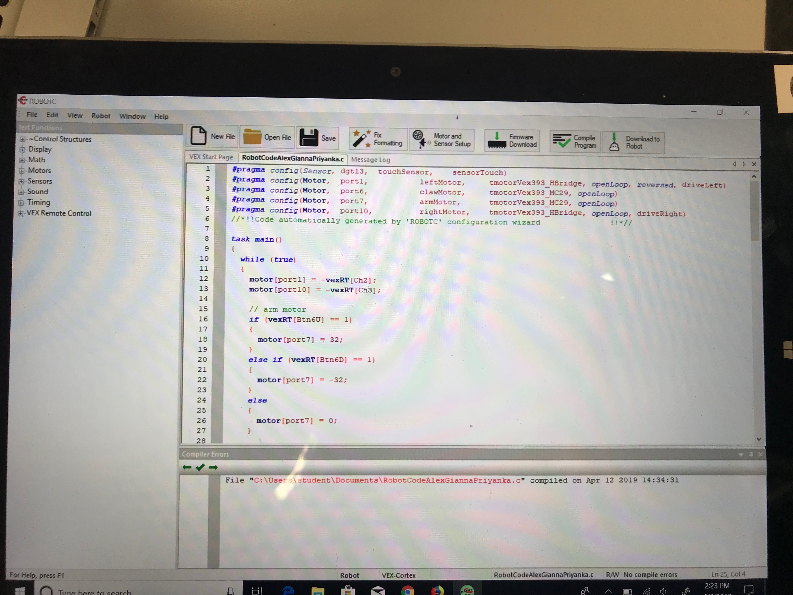

<!DOCTYPE.html>
<html>
<body>

    
 
 
    <h1>8th Grade Digital Portfolio</h1>
      
     

    
    
    <!--
    MADE WITH <3 & Brackets
    -->
    <h2>
        WhiteBox Learning 
    </h2>
    
 
    <ul>
        <li><a target="_blank"
               href=https://www.whiteboxlearning.com>WhiteBox Learning Link</a>
        </li>
    </ul>
    
    
On WhiteBox Learning we created our own prostetic arm model. The picture below is my model.
    

    
    
    
    

    The picture below is the class testing there prostectic arms.
    

    
    
    
    

    <h2>
    SketchUp 3D Modeling and Printing Project
    </h2>
    </a>
    <ul>
        <li><a target="_blank"
               href=https://https://www.sketchup.com>SketchUp Link</a>
               
        </li>
    </ul>
    
    

    In SketchUp we got to create a 3D model project. Then we got to print it on our 3D printer 
    

    

Below is a picture of a prosthetic hand, that was created from our 3D printer 

<h2>
VEX Project
</h2>

</a>
    <ul>
        <li><a target="_blank"
               href=https://www.vexrobotics.com/>VEX Robotics</a>
        </li>
    </ul>

On VEX we bulit, designed, and programmed robots. We then competed in a robot battle. 

Below is the coding for our robots

This is us constructing our robots

This is a picture of the robot competition 

<h2>
Website Design Project
</h2>

    Before creating our website we completed tutorials on StudioWeb and KhanAcademy. We learned how to use a system of coding called HTML and CSS, which we aplied to our websites. 

    
    
    </body>
</html>
